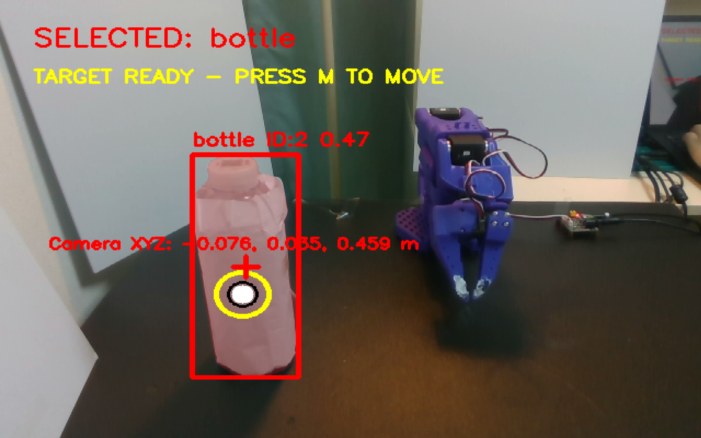
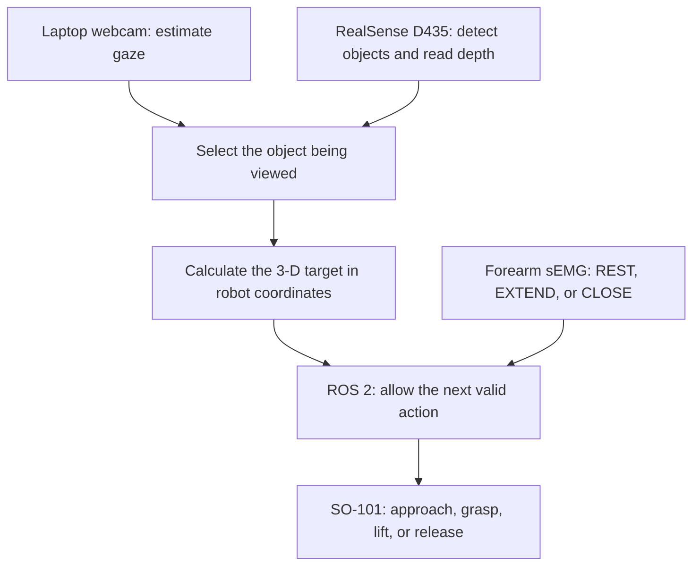
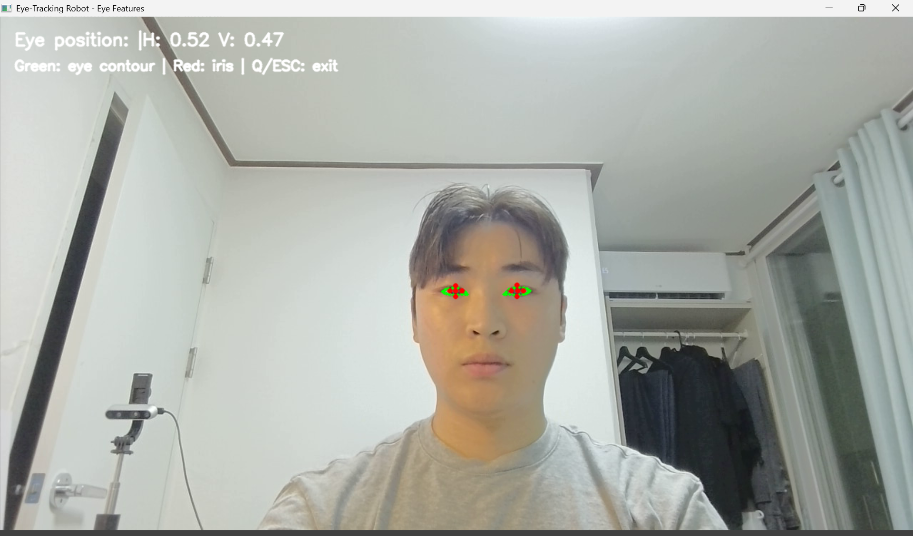
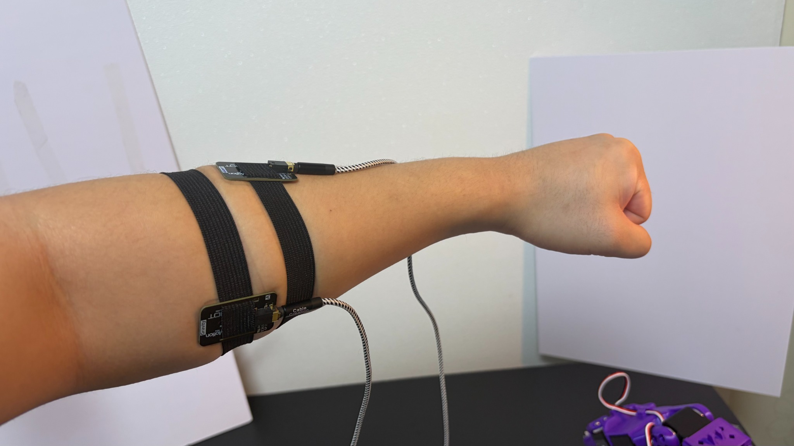
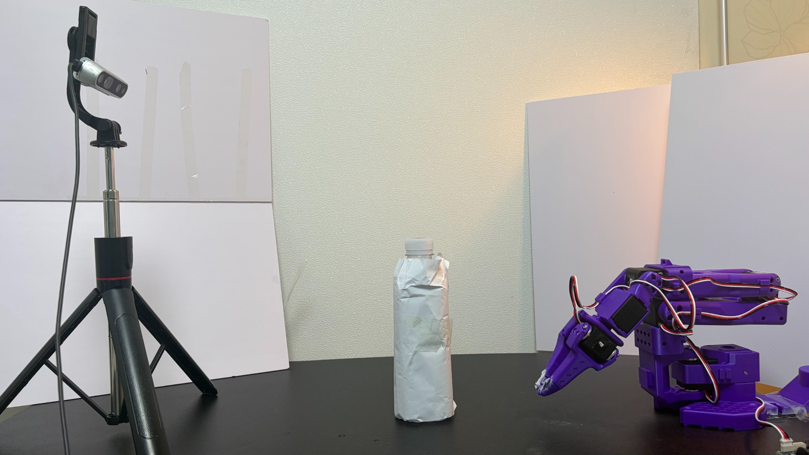

# Gaze- and sEMG-Controlled Robotic Grasping

An end-to-end human–robot interface in which gaze selects an object and forearm surface electromyography (sEMG) controls the grasp.

<p align="center">
  
</p>

<p align="center"><em>The gaze interface selects a tracked bottle and recovers its 3-D position before robot motion is enabled.</em></p>

The two inputs have separate roles:

- **Gaze answers “which object?”**
- **Forearm sEMG answers “what should the robot do next?”**

The complete system was demonstrated on a physical SO-101 robot arm: a bottle was selected by gaze, localized with RGB-D depth, approached, grasped, lifted, and released.

## System overview



## How a grasp works

<table>
  <tr>
    <td align="center"></td>
    <td align="center"></td>
  </tr>
  <tr>
    <td align="center"><strong>Gaze selects the object</strong></td>
    <td align="center"><strong>Forearm sEMG controls the grasp</strong></td>
  </tr>
</table>

1. A laptop webcam records the user’s eyes.
2. MediaPipe iris and eye-corner landmarks are converted into a calibrated gaze point.
3. YOLO segments objects in the D435 image, while ByteTrack maintains their IDs.
4. Looking at the same object for 0.75 seconds selects it.
5. Aligned D435 depth and a calibrated camera-to-robot transform recover the object’s 3-D position relative to the robot.
6. After a manual safety confirmation, ROS 2 and MoveIt move the SO-101 to a pre-grasp position.
7. Forearm sEMG commands open, grasp-and-lift, and release actions.

## Grasp command sequence

| Input | Accepted robot state | Robot response |
|---|---|---|
| Gaze selection + manual confirmation | IDLE | Move to the pre-grasp position |
| EXTEND | PRE-GRASP | Open the gripper and enter ARMED |
| CLOSE | ARMED | Descend, close the gripper, and lift |
| EXTEND | HOLD | Release the object and return to IDLE |
| REST | Any state | No motion; allow the next sEMG command |

Commands that do not match the current state are rejected. A stable REST classification is required between active sEMG commands.

## Implementation

| Part | Implementation |
|---|---|
| Gaze estimation | MediaPipe Face Landmarker, normalized iris geometry, nine-point calibration, and least-squares regression |
| Object selection | YOLO segmentation, ByteTrack IDs, mask-first gaze testing, and a 0.75 s dwell |
| 3-D localization | Aligned RealSense D435 depth, pinhole deprojection, and a rigid camera-to-base transform |
| sEMG acquisition | Two SEN0240 channels sampled by the STM32F407 ADC with timer-triggered circular DMA at 1 kHz |
| sEMG classification | Causal 60 Hz notch filter, 200 ms windows every 100 ms, 12 time-domain features, and three-class LDA on the STM32 |
| Command filtering | Three stable embedded classifications, followed by a 4-of-5 vote and REST re-arm on the PC |
| Robot control | ROS 2 Jazzy, MoveIt 2, a grasp state machine, workspace checks, reduced-speed motion, and fixed wrist roll |

## Measured results

The measurements below are from the final session-specific calibration and bench setup. They should not be interpreted as cross-user performance.

| Measurement | Result |
|---|---|
| Camera-to-robot calibration | 17.2 mm RMSE |
| sEMG validation set | 1,158 windows with trial-grouped cross-validation |
| Balanced sEMG accuracy | 81.4% |
| Class recall | CLOSE 92.0%, EXTEND 63.4%, REST 88.8% |
| 60 Hz filtering at REST | Channel SD reduced from 807 to 141 counts and from 583 to 92 counts |
| Physical demonstration | Bottle selection, approach, grasp, lift, and release completed end to end |

## Hardware

<p align="center">
  
</p>

- SO-101 follower robot arm
- Intel RealSense D435 RGB-D camera
- Laptop webcam
- STM32F407 Discovery board
- Two DFRobot SEN0240 sEMG sensors
- Laptop running Windows and Ubuntu 24.04 through WSL2

## Software

- Python 3.12
- OpenCV, MediaPipe, NumPy, scikit-learn, Ultralytics YOLO, and pyserial
- Intel RealSense SDK / `pyrealsense2`
- STM32CubeIDE and STM32 HAL
- ROS 2 Jazzy and MoveIt 2
- SO-101 ROS 2 and MoveIt packages

## Repository structure

```text
gaze_tracking/src/       Gaze calibration, object tracking, RGB-D localization,
                         target selection, and the Windows perception app

semg_control/firmware/   STM32F407 ADC/DMA acquisition, signal processing,
                         feature extraction, and embedded LDA inference

semg_control/tools/      Dataset collection, classifier training, and the
                         Windows-to-ROS sEMG bridge

robot_control/ros2/      TCP bridges, grasp state machine, MoveIt planning,
                         and SO-101 execution

robot_control/src/       Robot diagnostics and calibration utilities
tests/                   Hardware-independent integration tests
RUN_INTEGRATION.md       Detailed full-system startup and safety procedure
```

## Local calibration files

Personal calibration data and generated models are intentionally excluded from Git. Before running the complete system, generate or provide:

- the MediaPipe Face Landmarker model;
- gaze calibration samples and the fitted gaze model;
- the camera-to-robot calibration;
- the YOLO segmentation weights; and
- the generated sEMG LDA header used by the STM32 firmware.

### Gaze calibration

From a Windows Conda prompt in the repository:

```bat
python gaze_tracking\src\calibration_test.py
python gaze_tracking\src\train_gaze_regression.py
```

### sEMG calibration

Put the STM32 firmware into raw-stream mode, then collect and train with:

```bat
python semg_control\tools\collect_semg_dataset.py --port COM6
python semg_control\tools\train_semg_classifier.py
```

Copy the generated `semg_lda_model.h` into the firmware include directory, rebuild the STM32CubeIDE project, and flash the board.

## Running the full system

Read [RUN_INTEGRATION.md](RUN_INTEGRATION.md) before enabling physical motion. The runtime uses one WSL terminal and two Windows terminals.

### 1. Start ROS 2 and the physical robot in WSL

```bash
source /opt/ros/jazzy/setup.bash
source ~/ros2_ws/install/setup.bash

ros2 launch gaze_motion_planner gaze_moveit_demo.launch.py \
  hardware_type:=real \
  follower_usb_port:=/dev/so101_follower \
  execute_motion:=true \
  use_rviz:=true
```

### 2. Start gaze and RGB-D perception in Windows

```bat
conda activate gaze-tracking
cd C:\Users\jehyu\eye-tracking-robot-semG

python gaze_tracking\src\perception_app.py --enable-robot-send --robot-host 127.0.0.1 --approach-height 0.06
```

Look at an object until it is selected, verify that the workspace is clear, and press `M` to send the guarded pre-grasp target. Press `R` to clear the target and `Q` or `Esc` to quit.

### 3. Start the sEMG bridge in a second Windows terminal

```bat
conda activate gaze-tracking
cd C:\Users\jehyu\eye-tracking-robot-semG

python semg_control\tools\semg_ros_bridge.py --serial-port COM6 --host 127.0.0.1
```

If Windows cannot reach the WSL bridge through `127.0.0.1`, follow the network fallback in [RUN_INTEGRATION.md](RUN_INTEGRATION.md).

## Tests

The hardware-independent integration tests cover approach-height handling, workspace rejection, sEMG voting, protocol parsing, and target transmission:

```bash
python -m unittest tests/test_integration_pure.py
```

## Safety and current limitations

- Keep a hand next to the robot’s 12 V power disconnect during physical tests.
- Terminal shutdown is not a hardware emergency stop.
- Physical motion requires an explicit `M` key confirmation and `execute_motion:=true`.
- Targets outside the guarded robot workspace are rejected on both Windows and ROS 2 sides.
- Gaze and sEMG models are calibrated for the current user and setup.
- The project does not include force control or a general grasp planner for arbitrary objects.
- The physical result is an end-to-end demonstration, not a large grasp-success study.

## Author

Jehyung Han — Electrical Engineering, NYU Abu Dhabi
